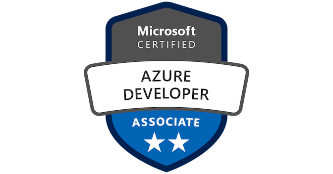

<h1 align="left">Josh Erskine - Software Engineer, C# / Azure / AI 👋</h1>

  <b>C# · .NET · Microsoft Azure · AI Product Engineering · Agentic Workflows</b> 

---

## About

Backend engineer shipping production features for a live fintech product -
flow architecture, third-party integrations, and real-time systems in
C#/.NET on Azure. Now tilting toward **AI application engineering**:
building products that use AI (RAG, agents, generative features) with
Azure OpenAI, Azure AI Search, and Claude Code.

I build my personal projects through an **agentic pipeline I designed
myself** - a multi-stage orchestration system (intent → spec → architecture
→ plan → build → ship) with gated human sign-off, state tracking, and
enforced artifact discipline. 

🔗 [agent-pipeline](https://github.com/JoshErskine/agent-pipeline)

**AZ-900 certified · HashiCorp Certified: Terraform Associate (003) · AZ-204 certified**

---

## Featured Projects

### ☁️ Azure E-Commerce Platform
> Cloud-native e-commerce backend · C# / .NET 10 · Microsoft Azure · Terraform

A production-grade multi-service platform built as a project alongside my AZ-204 studies,
covering the full cloud engineering stack:

- **REST API** - App Service, Cosmos DB, Azure SQL, Key Vault,
  Managed Identity
- **Event-driven pipeline** - Service Bus, Azure Functions, Blob Storage
- **Observability** - Application Insights, API Management,
  dead-letter queue handling
- **Infrastructure as Code** - Terraform

🔗 [Repository](https://github.com/JoshErskine/azure-ecommerce-platform)

---

### 🎙️ Outspoken *(in progress)*
> Windows dictation utility · C# / .NET 8 · local Whisper · LLM cleanup

A push-to-talk dictation tool built to replace a paid subscription: hotkey → local
Whisper speech-to-text (voice never leaves the machine) → LLM cleanup →
clean text at the cursor. Privacy
and latency are first-class design constraints. Built
end-to-end through my own agentic orchestration pipeline (spec → ADRs →
plan → build), from confirmed intent to public repo.

🔗 [Repository](https://github.com/JoshErskine/outspoken)

---

## Stack

  
  
  
  
  
  
  
  
  
  
  
  

&nbsp;

**Cloud:** Azure App Service · Cosmos DB · Azure SQL · Key Vault ·
Service Bus · Azure Functions · Blob Storage · API Management ·
Application Insights · Azure OpenAI · AI Search

**DevOps:** GitHub Actions · Terraform · CI/CD 

**AI:** Azure OpenAI Service · Azure AI Search · Claude Code ·
Prompt engineering · Agentic pipeline design

---

## Certifications

&nbsp; 

| Certification | Status |
|---|---|
| [AZ-900 Microsoft Azure Fundamentals](https://learn.microsoft.com/en-gb/users/joshuaerskine-8816/credentials/cc4d3d20e6857fd1) | ✅ Certified |
| [HashiCorp Certified: Terraform Associate (003)](https://www.credly.com/badges/20e3eb07-53dc-4f65-b924-77f253867fcf) | ✅ Certified |
| [AZ-204 Azure Developer Associate](https://learn.microsoft.com/en-us/users/joshuaerskine-8816/credentials/certification/azure-developer?tab=credentials-tab) | ✅ Certified |
| AI-103 Azure AI Apps & Agents Developer | 🎯 In progress  |

---

## Let's Connect

  
  

